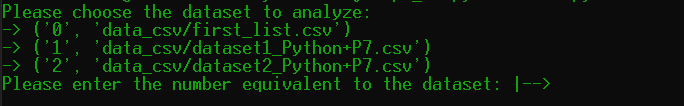
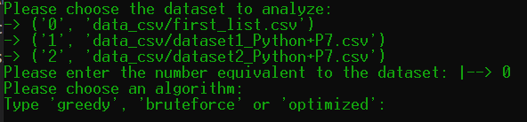

# Projet 7 - Résolvez des problèmes en utilisant des algorithmes en Python
  

***

Ce programme permet de trouver la combinaison d'actions qui rapporte le plus dans un délais de deux ans à partir de trois jeux de données.  
Pour résoudre ce problème trois algorithmes seront utilisés et comparés

***
***

## Les Algorithmes

Les trois algorithmes utilisés seront:
* I. Algorithme de force brute
* II. Algorithme glouton
* III. Algorithme optimisé
   
## Les jeux de données
* **first_list**  
fichier CSV de 20 actions
* **dataset1**  
fichier CSV de 1002 actions
* **dataset2**  
fichier CSV de 1001 actions contenant (volontairement) certaines données erronées

***
***
## 1.) Installation du programme

### Langage utilisé **Python**.
Ce script fonctionne au **minimum** sur la version **Python 3.4**.   

### Récupération du programme 
  
Ouvrir un terminal dans le dossier de destination et entrer la commande suivante pour télécharger le repository:   
  
    git clone https://github.com/Deadjuju/P7_OC.git

Il est également possible de télécharger le fichier zip du programme.  

### Environnement virtuel
Ce programme ne nécessite pas d'environnement virtuel.

## 2.) Exécution du programme

Ouvrir un terminal à la racine du dossier. 

Pour exécuter le programme rentrer la commande suivante dans le terminal:

        python main.py

Entrer le chiffre correspondant au jeu de donnée désiré.   
   
 

Entrer ensuite le nom de l'algorithme souhaité.

 

Et laisser le programme s'exécuter.
